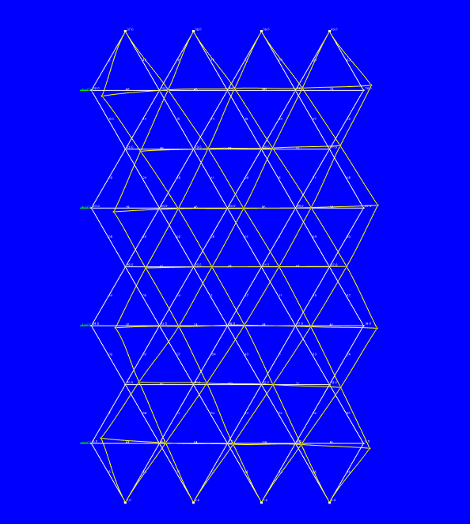

# Lab Noteook   
# Create Lattice Patterns (2D):   
Tried using a prine number grid, that shit didn't work (works for small sized lattice grids). Code **[here](https://github.com/GaneshPimpale/OpenMNN/blob/main/latticeGen.py)** under hex\_2d(). However, hex\_2*d\_*v2() is fully functional:    
   
    
(above: m=4, n=4, l=1, hex grid)   
   
# Solving Lattice Patterns (2D):   
Two possible libraries to assemble and test lattice structures under leoad TrussPy and PyNite. Both have 2D and 3D functionality. Both are implemented **[here](https://github.com/GaneshPimpale/OpenMNN/blob/main/latticeSolver.py) **(). PyNite is the ideal choice for solving lattice structures under load since it runs siginicantly faster compared to trusspy   
   
    
(above: visual output of pyNite FEM)   
   
# Optimizing Lattice E Values with Genetic Algorithms (2D):   
To run the gentic algorithm, I'm using **[pyGAD](https://pynite.readthedocs.io/en/latest/quickstart.html)**. This allows for the following settings:   
```
def lattice_func(e_vals):
    disp, pos, K = latticeSolver.solve_pynite_2d(
            nodes, node_ids, beams, beam_ids, e_vals, input_vecs, output_nodes
    )
    mse = mse_3d(disp, fin_disp)
    return mse 

def fitness_func(ga_instance, solution, solution_idx):
   	mse = lattice_func(solution)
    fitness = (1.0/np.abs(mse - des_mse)+0.00000001)
    #mse_ouputs.append(mse)
    #fitness_ouputs.append(fitness)
    print('MSE:' + str(mse) + ' Fitness:' + str(fitness))
    return fitness

# PyGAD parameters
fitness_function = fitness_func
num_generations = 20
num_parents_mating = 6
sol_per_pop = 8
num_genes = len(E_values)
init_range_low = 0
init_range_high = 500000
parent_selection_type = "sss"
keep_parents = 1
crossover_type = "single_point"
mutation_type = "random"
mutation_percent_genes = 10
```
   
In this proicess we want to maximise the fitness function and minimize tbe MSE (mean squared error). By plottoing the MSE and fitness value we can visualize the progress made by the gneentic algorithm on a few test cases   
   
Input vector for all test cases: [(4000, 0, 0), (4000, 0, 0), (4000, 0, 0), (4000, 0, 0)]
   
   
    
Initial displacement (no optimization, all E = 29000)   
   
## Test 1   
[(-3, 0, 0), (0, 0, 0), (3, 0, 0), (0, 0, 0)]   
    
    
Fitness in blue, MSE in red.   
Fitness value of the best solution = 0.3345164380228945
Predicted output based on the best solution : 3.9893898063851125   
   
## Test 2    
[(-1, 0, 0), (0, 0, 0), (1, 0, 0), (0, 0, 0)]
   
    
    
   
Fitness value of the best solution = 60.7755980868259
Predicted output based on the best solution : 0.9835460278196537   
   
## Test 3   
[(0, 0, 0), (3, 0, 0), (3, 0, 0), (0, 0, 0)]   
    
    
Fitness value of the best solution = 0.8665756670170537
Predicted output based on the best solution : 2.153967333264614
   
   
## Test 4   
[(0, 0, 0), (-3, 0, 0), (-3, 0, 0), (0, 0, 0)]   
    
    
Fitness value of the best solution = 0.2064472291199092
Predicted output based on the best solution : 5.843853088760558   
   
## Test 5   
[(3, 0, 0), (-3, 0, 0), (-3, 0, 0), (3, 0, 0)]   
    
    
Fitness value of the best solution = 0.11450563307507443
Predicted output based on the best solution : 9.733195568433878
   
   
   
